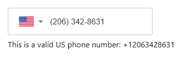
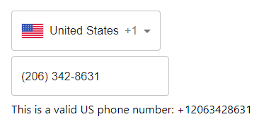

[](https://www.npmjs.com/package/mui-phone-textfield)
[](https://www.npmjs.com/package/mui-phone-textfield)
[](https://github.com/recursive-beast/mui-phone-textfield/actions/workflows/build.yml)
[](LICENSE)

# mui-phone-textfield
> A phone number input for Material-UI.

## Installation

To install this package via [npm](https://npmjs.org):

```sh
npm i mui-phone-textfield
```

And its peer dependencies:

```sh
npm i react react-dom @mui/material @emotion/react @emotion/styled
```

## Usage

The package exports mainly two components: [PhoneTextField](#phonetextfield) and [CountrySelect](#countryselect)

You can use the text input alone:

```javascript
import { Box } from "@mui/material";
import PhoneTextField from "mui-phone-textfield";
import { useState } from "react";

function Example() {
  const [value, setValue] = useState("");
  const [country, setCountry] = useState("US");

  return (
    <Box sx={{ m: 2 }}>
      <PhoneTextField
        country={country}
        onCountryChange={setCountry}
        onPhoneNumber={setValue}
      />
      <Box sx={{ my: 1 }} />
      {value && <Box>This is a valid {country} phone number: {value}</Box>}
    </Box>
  );
}
```



You can also separate the country menu and the text input:

```javascript
import { Box } from "@mui/material";
import { CountrySelect, PhoneTextField } from "mui-phone-textfield";
import { useState } from "react";

function Example() {
  const [value, setValue] = useState("");
  const [country, setCountry] = useState("US");

  return (
    <Box sx={{ m: 2 }}>
      <CountrySelect value={country} onCountryChange={setCountry} />
      <Box sx={{ my: 1 }} />
      <PhoneTextField hideSelect country={country} onPhoneNumber={setValue} />
      <Box sx={{ my: 1 }} />
      {value && <Box>This is a valid {country} phone number: {value}</Box>}
    </Box>
  );
}
```



## Props

### PhoneTextField

In addtion to [TextField](https://mui.com/material-ui/react-text-field)'s props, The `PhoneTextField` component accepts the following:

| prop | type | description|
|-|-|-|
| country | string | The selected country. A [two-letter ISO country code](https://en.wikipedia.org/wiki/ISO_3166-1_alpha-2) |
| hideSelect | boolean | Hides the internal select component. Useful when using [CountrySelect](#countryselect) alongside this component |
| disableFormatting | boolean | Disables formatting the user's input |
| onCountryChange | function | Callback fired when a user selects a country from the menu. It receives a country code |
| onPhoneNumber | function | Callback fired when the input value changes. If the input is a valid phone number for the current country, it receives it in [E.164](https://www.twilio.com/docs/glossary/what-e164) format, otherwise it receives an empty string |

### CountrySelect

In addtion to [Select](https://mui.com/material-ui/react-select)'s props, The `CountrySelect` component accepts the following:

| prop | type | description|
|-|-|-|
| hideCallingCode | boolean | Hides the calling code when rendering the selected value |
| hideCountryName | boolean | Hides the country name when rendering the selected value |
| placeholder | ReactNode | Renders the provided placeholder node when `displayEmpty` is set |
| onCountryChange | function | Callback fired when a user selects a country from the menu. It receives a country code |

## Contributing

### Prerequisites

-   [nodejs](https://nodejs.org)
-   [npm](https://npmjs.org)

### Getting Started

After cloning this repo, ensure dependencies are installed by running:

```sh
npm i
```

To build the final bundle:

```sh
npm run build
```

To rebuild on each change:

```sh
npm run dev
```

### Commiting changes

Please follow the [conventional commits](https://www.conventionalcommits.org) specification, because [semantic-release](https://github.com/semantic-release/semantic-release) is used to automate the whole package release workflow including: determining the next version number, generating the release notes and publishing the package.

## License

[MIT](LICENSE)
